# Proyecto Integrador gLabs 

<h1>Procedimiento</h1>
  <h2>1.Diagramas</h2>
    <h3>1.1 Diagramas de casos de uso</h3>
    
Para realizar el diagrama de casos de uso, hemos aplicado unos pasos lógicos. Estos son:

<ol>
  <li>Identificar los actores principales. Tendremos que identificar de una forma correcta a los usuarios externos que interactuarán con el sistema.</li>
  <li>Identificar los casos de uso. Debemos de identificar las principales funcionalidades que el sistema debe proporcionar a los actores. Los casos de uso representan las interacciones entre los actores y el sistema.</li>
  <li>Nombrar esos casos de uso de una forma coherente.</li>
  <li>Determinar las relaciones de include y extend. El include lo encontramos cuando un caso de uso depende de otro caso de uso para su ejecución, mientras que el extend lo usamos cuando un caso de uso es opcional y agrega funcionalidades adicionales a otro caso de uso.</li>
  <li>Diseñar el diagrama UML que represente visualmente a los actores, casos de uso y relaciones que existen entre ellos.</li>
</ol>

En nuestro caso, el caso de uso "Login" está incluido en todos los casos de uso. Esto significa que el inicio de sesión es una parte necesaria para acceder a las funcionalidades de gestión de proyectos integradores, alumnos y áreas.

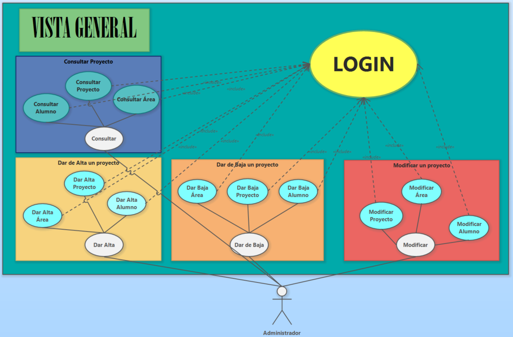

<h3>1.2 Diagramas de clases</h3>

 Es una parte fundamental del lenguaje de modelado unificado (UML) y se utiliza para mostrar las clases, sus atributos, métodos y las relaciones entre ellas. Primero tenemos que identificar las clases principales. Luego identificaremos los atributos y métodos para cada clase. Tendremos que establecer las relaciones entre clases e identificar si son relaciones uno a uno, uno a muchos y muchos a muchos, así como la composiciones y agregaciones. Además, deberemos analizar si existe algún tipo de herencia entre las clases. El diagrama tiene que mantener la simplicidad y claridad, se trata de capturar los aspectos fundamentales de la estructura y las relaciones de clases para una comprensión efectiva.

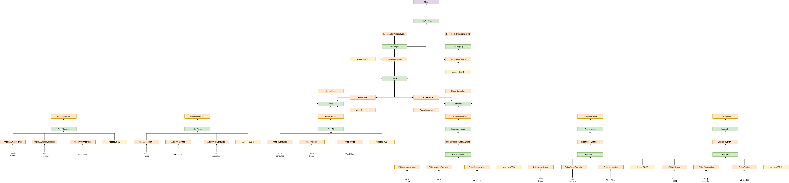

<h2>2. Diseño de Interfaces</h2>
 
Para realizar el diseño gráfico de las interfaces es necesario seguir estos criterios generales:

 
 <ul>
  <li>Jerarquía clara: Establecer una estructura visual que destaque los elementos principales y transmita un orden de ejecución.</li>
  <li>Foco en elementos clave: Resaltar las zonas relevantes y agrupar los elementos principales para facilitar la comprensión y navegación del usuario.</li>
  <li>Homogeneidad: Mantener consistencia en la estructura de la interfaz en todas las ventanas para una experiencia coherente.</li>
  <li>Relaciones visuales: Colocar cerca los elementos relacionados funcionalmente y evitar interfaces sobrecargadas.</li>
  <li>Estructura visual y flujo de trabajo: Mantener una estructura clara que permita una navegación fluida según el flujo de trabajo de la aplicación.</li>
  <li>Alineación de elementos: Alinear visualmente los elementos para mejorar la experiencia de usuario y usar una rejilla como guía.</li>
  <li>Acceso rápido: Utilizar atajos de teclado para acceder a opciones frecuentemente utilizadas.</li>
  <li>Navegación intuitiva: Usar iconos y convenciones de navegación estándar para facilitar la ubicación y acceso a las funciones.</li>
  <li>Visualización de información: Presentar información relevante de forma clara y concisa, utilizando gráficos y esquemas.</li>
  <li>Entrada de datos simplificada: Minimizar las acciones de entrada de datos y proporcionar ayuda y validación de datos cuando sea necesario.</li>
  <li>Interacción efectiva: Orientar al usuario, solicitar confirmación en acciones importantes y brindar una comunicación clara.</li>
  <li>Uso efectivo del color: Utilizar el color para representar información compleja de manera consistente.</li>
  <li>Diseño de ventanas y menús: Dividir el espacio en áreas funcionales y utilizar una barra de menús organizada.</li>
  <li>Botones claros: Utilizar botones para acciones importantes con contenido legible y accesibilidad mediante teclas rápidas.</li>
  <li>Sistemas de ayuda: Proporcionar asistencia contextual y mensajes de error claros.</li>
</ul>

Estos principios de diseño de UI garantizan una experiencia de usuario mejorada y una mayor usabilidad en las aplicaciones.

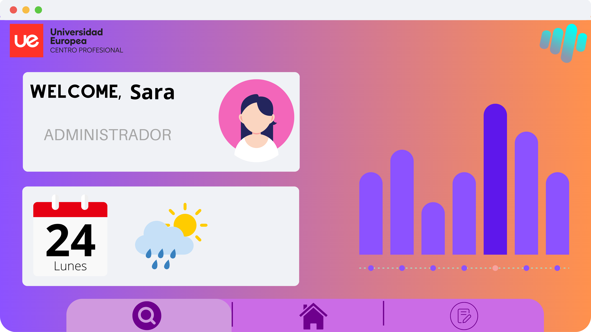

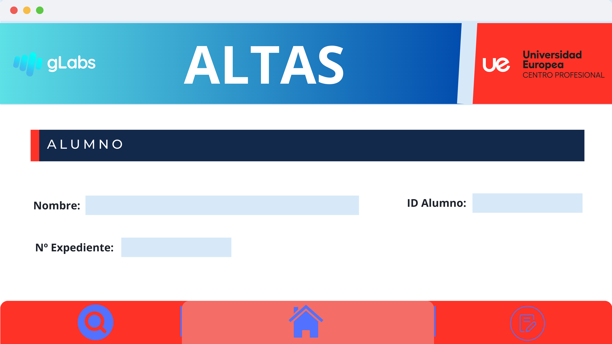
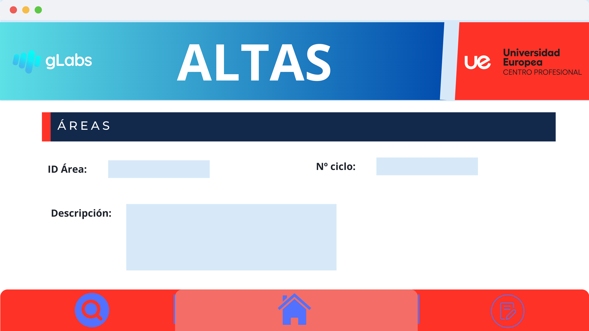
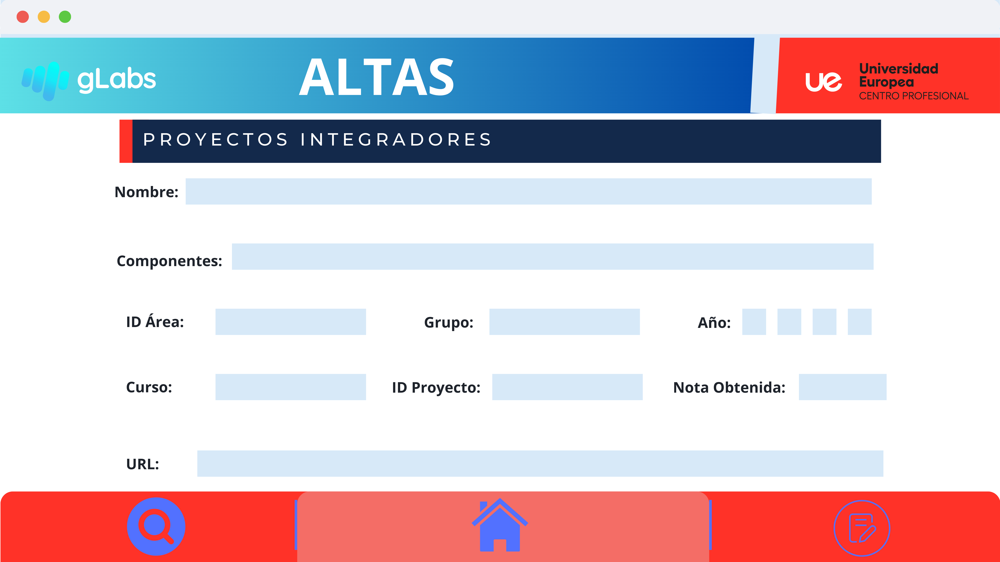

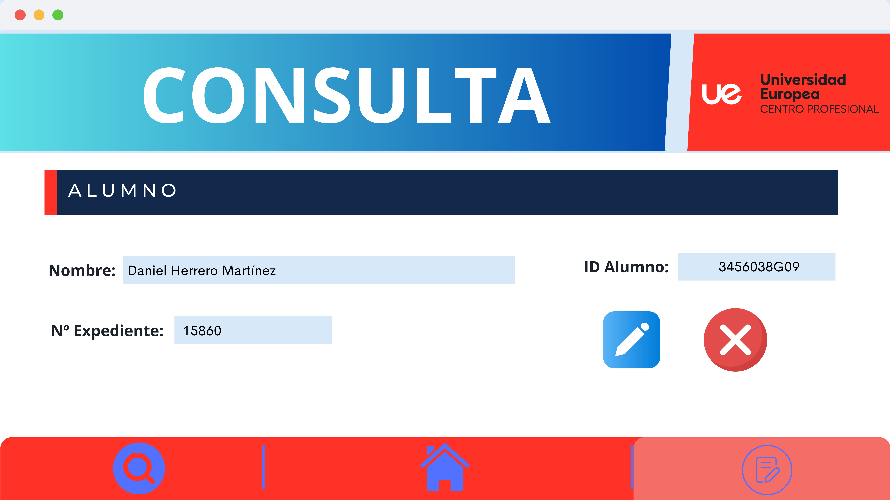
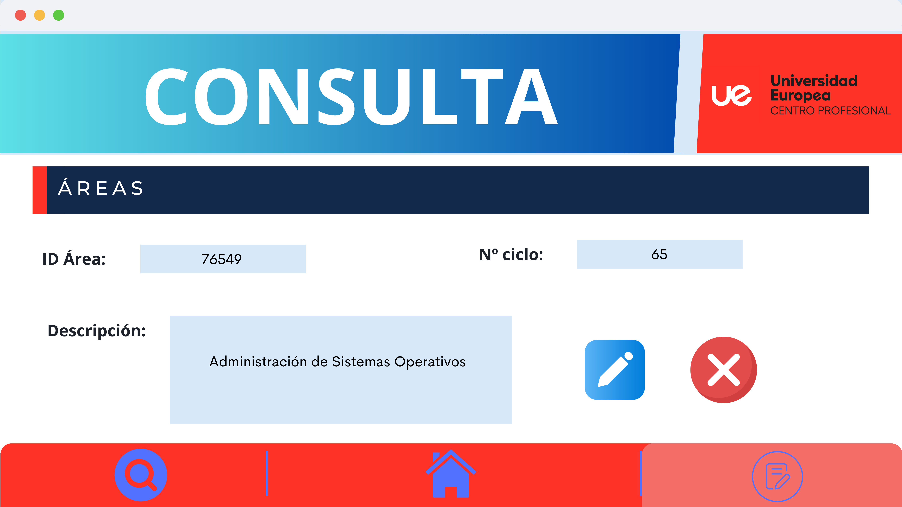
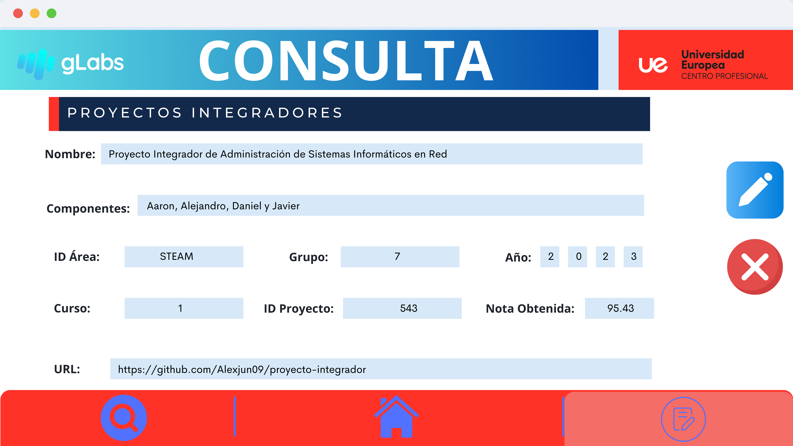

<h2>3. Creación e implementación de una base de datos</h2>

En el proyecto, está contemplada una Base de datos donde alojar todos los datos de los alumnos, áreas y proyectos integradores. En nuestro caso, también implementaremos un inicio de sesión para que sea más segura la aplicación, por lo tanto, en esa base de datos alojaremos en una tabla los usuarios y contraseñas del inicio de sesión. También está contemplada la opción de creación de nuevos usuarios con un formulario de registro. 

Para que el programa sea más accesible, hemos creado un servidor Ubuntu server 22.04 donde se aloja un servicio de MySQL. Esto nos permite tener a todos los creadores del proyecto la misma base de datos, lo que hace evitar errores. Pero esta acción está pensada para que el programa se pueda ejecutar desde cualquier dispositivo que soporte Java sin necesidad de trasladar con ella toda la base de datos. 

Lo primero de todo, es realizar un diagrama Entidad Relación. Primero, localizamos las tres grandes entidades principales: Área, Alumno y Proyecto Integrador. La entidad Área tiene los atributos ID_Area(clave primaria) y Descripción. La entidad Alumno tiene los atributos ID_Alumno (clave primaria), Número de Expediente, Nombre y ID_Proyecto (relación con la entidad de proyecto). Y La entidad Proyecto Integrador tiene los atributos ID_Proyecto(clave primaria), Nombre, URL, Nota, Año, Curso, Grupo y Área (relación con la entidad Área).

El diagrama de forma gráfica sería así:

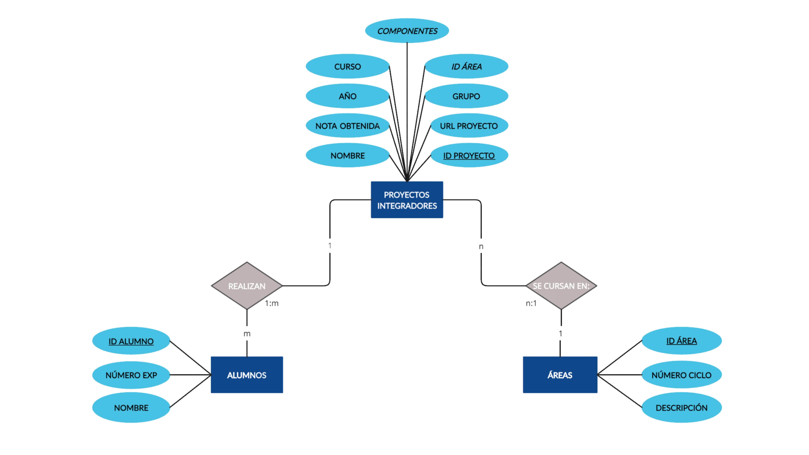

Del modelo Entidad relación anterior, sacamos el modelo relacional normalizado: 

Normalizamos la tabla “Proyectos integradores”
Para pasarlo a 1FN, eliminamos los atributos multivaluados creando nuevas tablas

PROYECTO (ID Proyecto, Nombre, Nota Obtenida, Año, Grupo, Url Proyecto, Curso, *ID Área)
PK ID Proyecto
FK ID Área → ÁREAS

La tablas “Áreas y Alumnos” como ya están en 1FN, quedarían así;
ÁREAS (ID Área, número ciclo, descripción)
PK ID Área
ALUMNOS (ID Alumnos, número exp, nombre, ID Proyecto)
PK ID Alumnos 
FK ID Proyecto →Proyecto

Para pasar las tablas a 2FN, es necesario separar los atributos que dependen de una parte de  la clave en distintas tablas. 
En este caso todas las tablas ya están en 2FN.

Ahora pasamos a 3FN. Para esto, los atributos que tienen dependencia de la PK de su 
tabla de forma transitiva se separan y pasan a una tabla nueva.
 

 
 <h2>4. Implementación en Java</h2>
 
Tras analizar todos los diagramas y el diseño de interfaces, podemos empezar a generar código para hacer realidad el proyecto. Primero, tendremos que crear un modelo en maven que nos proporciona el controlador JDBC (estándar de conectividad de bases de datos de Java). Al tener el proyecto en maven, el controlador se actualiza automáticamente. El proyecto está alojado en un repositorio en github. 

El proyecto sigue el patrón MVC (Modelo Vista Controlador) dividido en paquetes. La estructura de paquetes, sigue el siguiente esquema: 

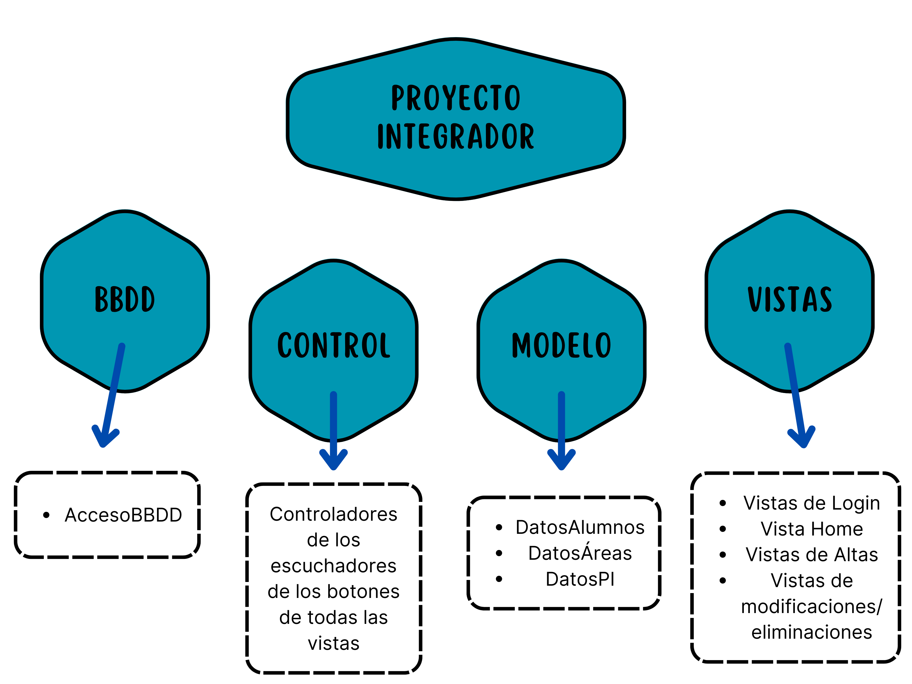

En el acceso a la base de datos, localizamos la conexión a la base de datos y los diferentes comandos de sql (querys) para hacer las altas, modificaciones, consultas y supresiones de datos.

En el paquete de control, localizamos toda la lógica de los botones de todo el programa. En total tenemos 40 botones. La mayoría de estos simplemente realizan el cambio de una vista a otra, sin embargo, hay otros que mandan la orden de ejecutar una query en la base de datos.

Dentro del paquete de modelo encontramos los datos que se transfieren del programa a la base de datos y viceversa.

Por último, en el paquete de vistas ubicamos todas las ventanas de la interfaz gráfica del programa. Si desglosamos el paquete, mantendría esta forma:

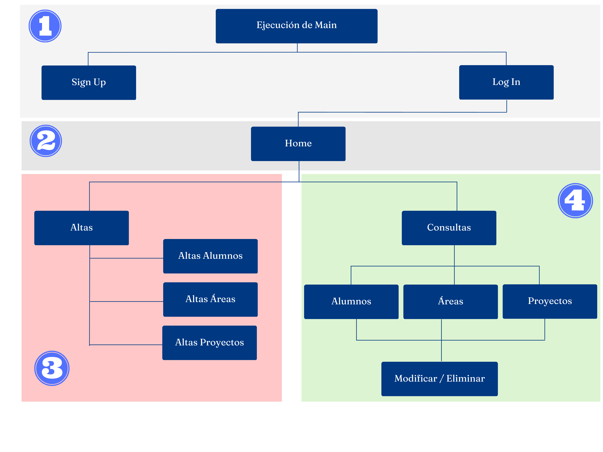

 

